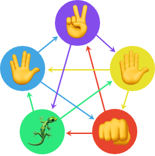

# RPSLS - Rock, Paper, Scissors, Lizard, Spock

Rock Paper Scissors Lizard Spock is an expansion of the game Rock, Paper, Scissors. It was created by Sam Kass and Karen Bryla, but it was popularized in an episode of the Big Bang Theory called The Lizard-Spock expansion. You can read a bit more about it at [this website](https://bigbangtheory.fandom.com/wiki/Rock,_Paper,_Scissors,_Lizard,_Spock)
## The Rules
1. Scissors cuts Paper
2. Paper covers Rock
3. Rock crushes Lizard
4. Lizard poisons Spock
5. Spock smashes Scissors
6. Scissors decapitates Lizard
7. Lizard eats Paper
8. Paper disproves Spock
9. Spock vaporizes Rock
10. (and as it always has) Rock crushes Scissors
## Technologies
I used [Vue.js](https://vuejs.org/) to build this project and quickly bootstrapped it with the Vue CLI. I had used Vue before, but this would be my first project we're I took Vue for a spin beyond what I've learned from the docs and other intro tutorials. 
## Demo 
Checkout the demo [here](https://yarocruz.github.io/rpsls/)

